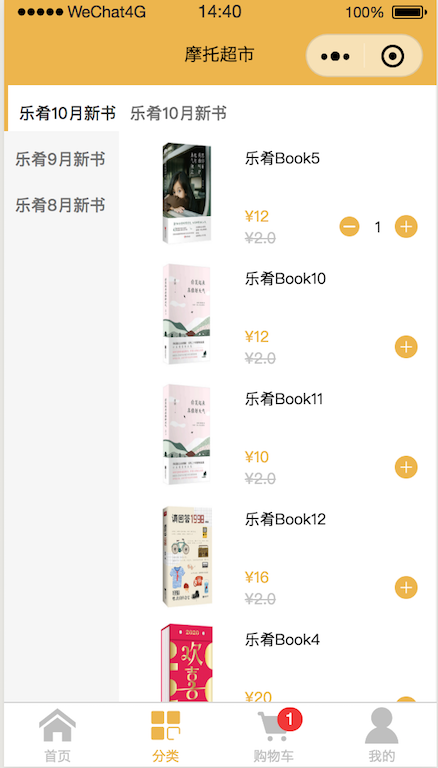
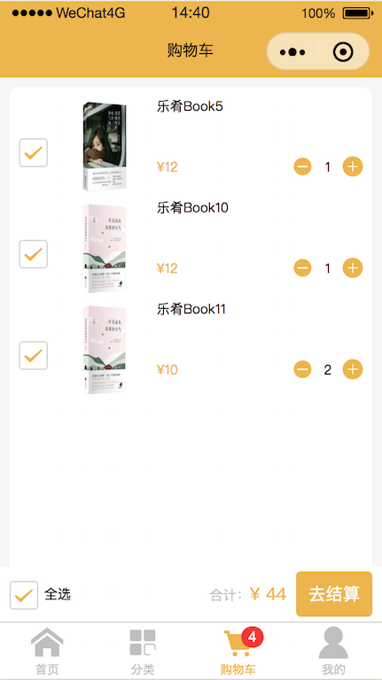

# 摩托超市
```
    这是一个利用小程序开发的商城前端Demo
    
```




## 知识点整理

#### 1、flex页面布局
```
  参考Home压面整体页面布局；
```
#### 点击加入购物车，抛物线动画的实现
```
  参考home.ts文件toCart()函数，利用wx.createAnimation() API实现抛物线动画；
```
#### 滑动右侧商品列表，监测更新左侧分类选中项
```
  参考category.ts文件bindscroll()函数，通过监测Element滑动属性更新左侧选中分类；
```

